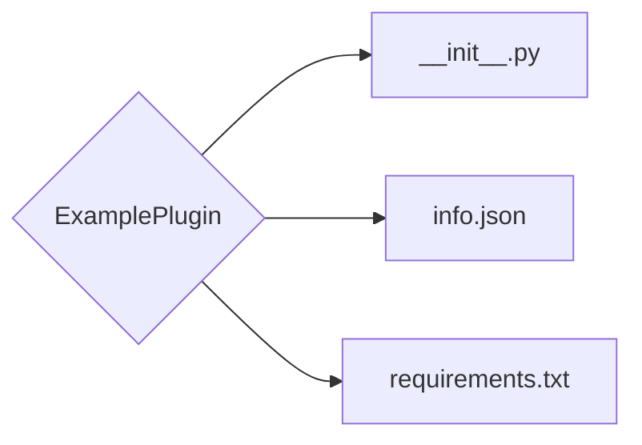
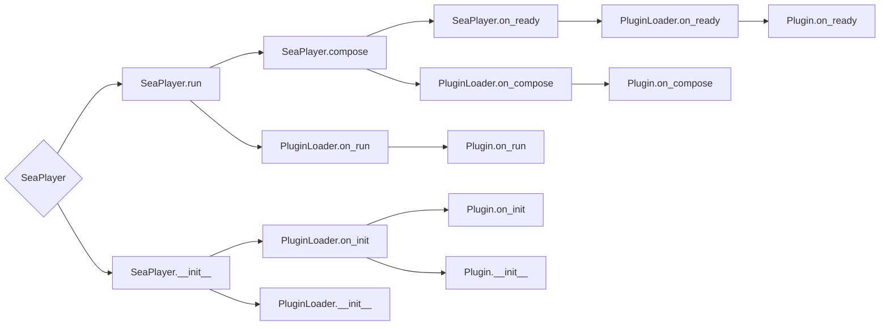

# Plugin Development
## Description
Creation/Testing the plugin requires using the [Plugin CLI](plugin-cli-home.md).

!!! note "It is recommended to read it."
    Be sure to read the **Plugin CLI** guide.

## Create Directory
```sh
mkdir ExamplePlugin
```

## Create Environment
```sh
seaplug create ExamplePlugin
```

The following file structure will be created:

!!! note "About `requirements.txt`"
    
    The default file is `requirements.txt` it's not being created, you have to create it yourself if our plugin uses third-party modules.

## File `info.json`
### Source
This is just information about your plugin.

```json title="ExamplePlugin/info.json"
{
    "name": "ExamplePlugin",
    "name_id": "seaplayer.plugins.example",
    "version": "1.0.0",
    "author": "Romanin",
    "description": null,    // optional
    "url": null             // optional
}
```
!!! note "Very important!"
    
    Think carefully about the `name_id`, because if it matches the `name_id` of another plugin, there may be a conflict when loading plugins.

## File `requirements.txt`
As mentioned above, the file `requirements.txt` it is not created after calling `seaplug create ExamplePlugin`, and it is **recommended to create it only if your plugin has dependencies with other modules**.

### Source
```txt title="ExamplePlugin/requirements.txt"
module>=version
...
```
!!! note "Nothing is difficult!"
    
    File `requirements.txt` it is filled in according to the same principle as a regular file `requirements.txt` in **Python**. [More information.](https://pip.pypa.io/en/stable/reference/requirements-file-format/)

## File `__init__.py`
### Source
```python title="ExamplePlugin/__init.py__"
from seaplayer.plug import PluginBase

class Plugin(PluginBase):
    pass

__plugin__ = Plugin
```
!!! note "Very important!"
    
    You don't have to write everything in one `__init__.py `, the most important thing is that in `__init__.py`, there was a variable `__plugin__` containing a reference to the class.

### The queue for launching the SeaPlayer


### Basic Usage
#### Method on_init
The method called immediately after initialization of the `SeaPlayer.__init__` class.

```python title="ExamplePlugin/__init.py__"
from seaplayer.plug import PluginBase

class Plugin(PluginBase):
    def on_init(self) -> None:
        pass

__plugin__ = Plugin
```

#### Method on_run
This method is called during a call to the `SeaPlayer.run` function.

```python title="ExamplePlugin/__init.py__"
from seaplayer.plug import PluginBase

class Plugin(PluginBase):
    def on_run(self) -> None:
        pass

__plugin__ = Plugin
```

#### Method on_compose
This method is called after all the interface elements have been arranged `SeaPlayer.compose`.

!!! note "A nuance!"
    
    It is also important to note that the function is launched via [`SeaPlayer.run_worker`](https://textual.textualize.io/api/dom_node/#textual.dom.DOMNode.run_worker).

```python title="ExamplePlugin/__init.py__"
from seaplayer.plug import PluginBase

class Plugin(PluginBase):
    async def on_compose(self) -> None: ...
        pass

__plugin__ = Plugin
```

#### Method on_ready
The function called after the SeaPlayer is fully started `SeaPlayer.on_ready`.

```python title="ExamplePlugin/__init.py__"
class Plugin(PluginBase):
    async def on_ready(self) -> None: ...
        pass
```

#### Method on_quit
Called when closing `SeaPlayer.on_quit`.

```python title="ExamplePlugin/__init.py__"
class Plugin(PluginBase):
    async def on_quit(self) -> None: ...
        pass
```
