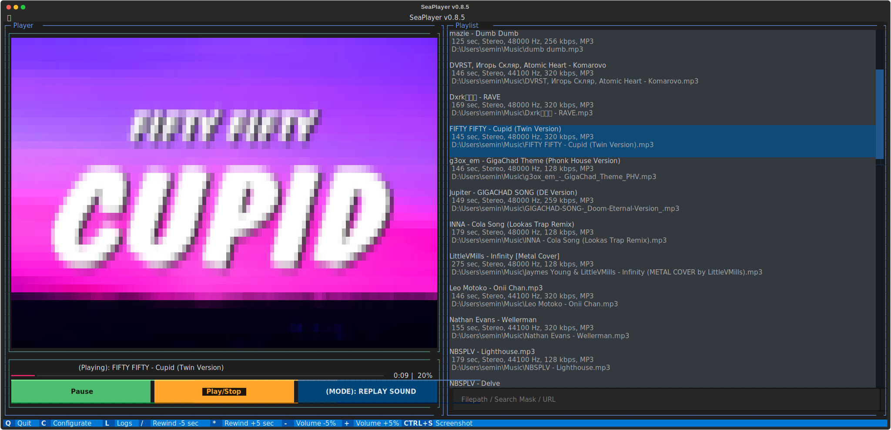
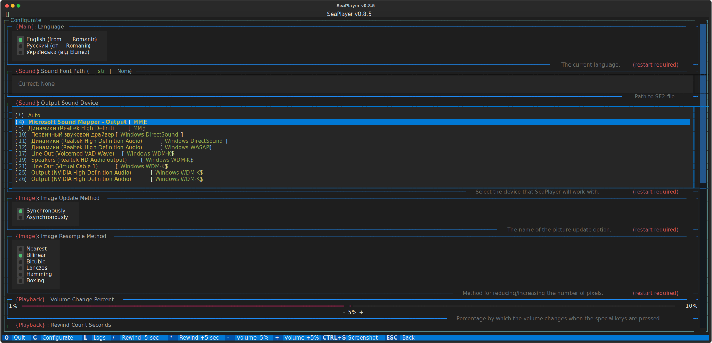

# Welcome to SeaPlayer
## Description
SeaPlayer is a player that works in the terminal.

Supports the following audio file formats: `MP3`, `OGG`, `WAV`, `FLAC`, `MIDI`.

Supports the following languages: `English`, `Русский`, `Українська`.

## Screenshots



## Using
=== "via `seaplayer`"
    ```bash
    seaplayer
    ```
=== "via `python -m`"
    ```bash
    python -m seaplayer
    ```

## Installation
```sh
pip install -U seaplayer
```

### Playing for MIDI 
In order to play MIDI files you need to install [FluidSynth](https://www.fluidsynth.org).

=== ":fontawesome-brands-windows: Windows"
    - [**Download**](https://github.com/FluidSynth/fluidsynth/releases) a zip file suitable for your version of Windows.
    - **Unpack the archive** anywhere, *but it is recommended to put it in a folder `C:\Program Files\FluidSynth`*
    - **Next**, open `Settings` > `System` > `About the system` > `Additional system parameters` > `Environment variables` > `[Double click on Path]` > `Create` > `[Enter the full path to the folder with FluidSynth]`
    - **That's it, FluidSynth is installed!**
=== ":material-ubuntu: Ubuntu"
    ```shell
    sudo apt-get install fluidsynth
    ```
=== ":material-arch: Arch Linux"
    ```shell
    sudo pacman -S fluidsynth
    ```
=== ":simple-macos: Mac OS"
    === "[Fink](http://www.finkproject.org/)"
        ```shell
        fink install fluidsynth
        ```
    === "[Homebrew](https://brew.sh/)"
        ```shell
        brew install fluidsynth
        ```
    === "[MacPorts](http://www.macports.org/)"
        ```shell
        sudo port install fluidsynth
        ```
